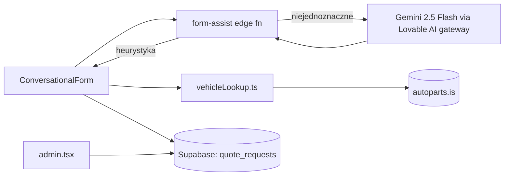

# ARCHITECTURE — mapa dla obcego (1 strona)

**Status: prototype (2026-08) — not maintained.** Ten dokument opisuje kod TAKI, JAKI JEST.

## Co to jest (3 zdania)
Request-to-quote narzędzie dla MAS Parts: klient (osoba lub warsztat) opisuje potrzebną część
samochodową lub towar do sprowadzenia z Europy, konwersacyjny formularz z asystą AI dopytuje o
szczegóły (VIN/rejestracja, zdjęcia, linki do ofert), a MAS wycenia i realizuje zakup + import do
Islandii. Model biznesowy: bezzwrotna opłata za wyszukanie (4 960 ISK z VAT) pobierana z góry,
wliczana w cenę zamówienia, jeśli klient kupi.

## Stack (z package.json)
- Frontend: React 18 + TypeScript + Vite · TanStack Router/Start (plikowy routing w `src/routes/`)
- Styl: Tailwind CSS + Radix UI (shadcn/ui)
- i18n: własny (`src/i18n/translations.ts`, `useLang.ts`) — en/pl/is, także w treściach generowanych przez AI
- Backend/DB: Supabase (Postgres + Auth + RLS + Edge Functions), 6 migracji (płytki schemat — wczesny etap)
- AI: edge function `form-assist` woła `google/gemini-2.5-flash` przez Lovable AI gateway; heurystyki
  bez AI obsługują oczywiste przypadki najpierw (oszczędność wywołań)
- Rejestr pojazdów: bezpośredni lookup w przeglądarce do `autoparts.is` (bez CORS/auth, zastąpił
  wcześniejszy most przez edge function) — `src/lib/vehicleLookup.ts`
- Hosting: Lovable

## Moduły i granice
| Katalog | Odpowiedzialność | Wejście | Tier |
|---|---|---|---|
| `src/routes/index.tsx` | strona główna + formularz zgłoszenia | URL | T2 |
| `src/routes/admin.tsx`, `admin.login.tsx` | back office: lista zgłoszeń, zmiana statusu, filtrowanie | URL, auth | T2 |
| `src/components/site/ConversationalForm.tsx` | krok-po-kroku formularz zgłoszenia (AI-assisted intake) | UI | T2 |
| `src/components/site/PriceCalculator.tsx` | orientacyjna kalkulacja kosztu | UI | T1 |
| `src/lib/vehicleLookup.ts` | lookup pojazdu po tablicy rejestracyjnej z `autoparts.is` | zewnętrzne API | T2 |
| `supabase/functions/form-assist/` | parsowanie/dopytywanie tekstu klienta (Gemini 2.5 Flash + heurystyki), tekst opłaty po en/pl/is | HTTP (wołane z formularza) | T3 |
| `supabase/migrations/` | schemat + RLS (6 plików) | — | T3 |

## Przepływ danych

## Gdzie jest…
- autoryzacja: Supabase Auth + RLS; panel admina za loginem (`admin.login.tsx`)
- ceny/kwoty: opłata za wyszukanie na sztywno w `form-assist` (`feeInfoText`, 4 960 ISK) — NIE w
  konfiguracji bazodanowej, zmiana ceny = zmiana kodu edge function
- i18n: `src/i18n/translations.ts` + rozproszone teksty en/pl/is w samej edge function
- sekrety: klucz do Lovable AI gateway czytany w edge function ze środowiska, nigdy nie trafia do
  przeglądarki; `.env` trzyma tylko publiczny klucz Supabase
- CI: `.github/workflows/quality.yml` — zdjęte razem z oznaczeniem prototypu, przywrócone tym PR
  po zielonym przebiegu lokalnym

## Decyzje nieodwracalne
`docs/adr/` — tylko szablon, brak formalnych ADR w trakcie życia projektu.

## Jak to cofnąć / kill switch
Prototyp wygaszony (status: not maintained). Model AI wołany z edge function — jeśli klucz gateway
kiedykolwiek wyciekł, rotacja w Supabase secrets tego projektu wyłącza dostęp bez zmian w kodzie.
